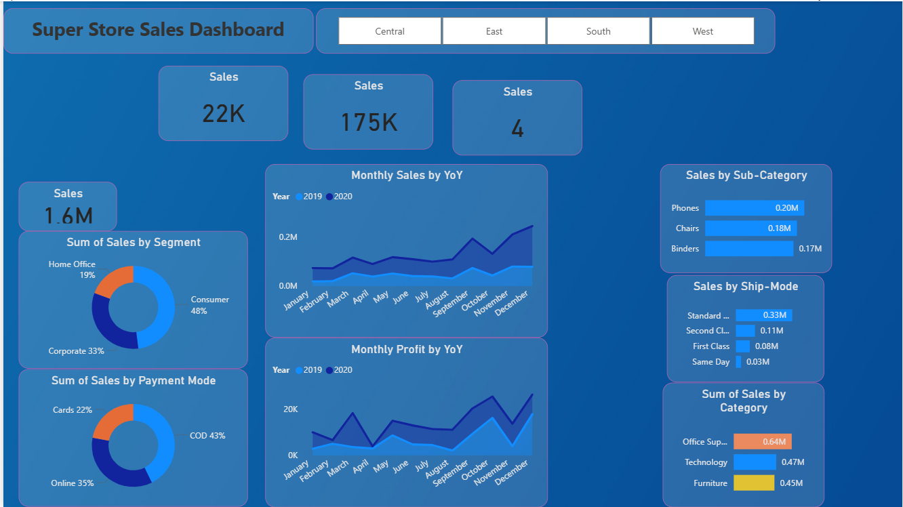
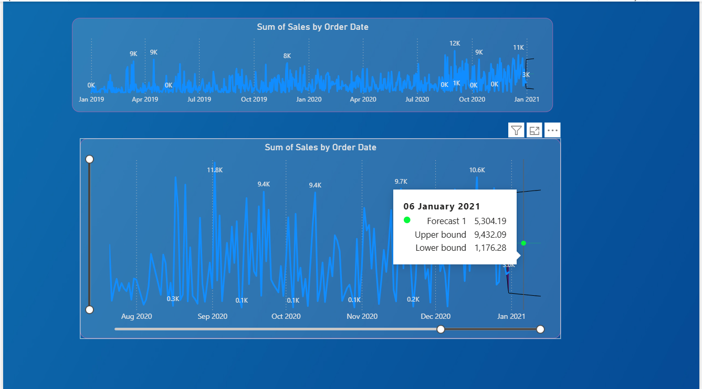

# 📊 Power BI Sales Dashboard

## 📌 Project Overview

This project is an interactive Sales Dashboard created using **Power BI** to analyze sales performance from the SuperStore dataset.

The dashboard provides insights into:

- Monthly Sales
- Monthly Profit
- Sales by Category
- Sales by Sub-Category
- Sales by Ship Mode
- State-wise Sales Analysis

---

## 🛠 Tools Used

- Power BI Desktop
- Microsoft Excel / CSV Dataset

---

## 📂 Dataset

SuperStore Sales Dataset

---

## 📈 Dashboard Preview

---
## 📈 Future Sales Analysis

---

## 🚀 Features

- Interactive filters
- KPI cards
- Year-over-Year comparison
- Sales trends
- Profit trends
- Category analysis
- Ship Mode analysis

---

## 📁 Files Included

- PowerBI-Sales-Dashboard.pbix
- SuperStore_Sales_Dataset.csv

---

## 👩‍💻 Author

Hari Shree
